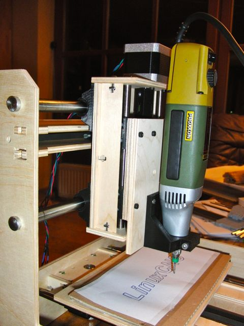

DesktopMiniMill
===============

Plans, parts and configuration files for a desktop cnc machine
The DesktopMiniMill is controlled by LinuxCNC and Beaglebone Black
The repository includes the CNC adapter PCB for the BBB and Pololu stepper drivers

See the DMM in operation: http://youtu.be/r77spFATp_I

